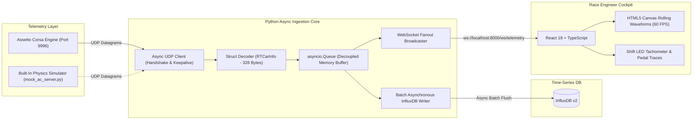

# High-Throughput Real-Time Telemetry Pipeline & Race Engineering Dashboard

[](https://github.com/MrDoor1234/assetto-corsa-telemetry/actions/workflows/ci.yml)
[](https://opensource.org/licenses/MIT)
[](https://www.python.org/)
[](https://fastapi.tiangolo.com/)
[](https://react.dev/)
[](https://www.docker.com/)

An end-to-end, sub-millisecond telemetry acquisition and visualization pipeline designed to replicate Formula 1 trackside garage data architectures. The system establishes a stateful two-way UDP handshake with **Assetto Corsa**, decodes 328-byte packed binary telemetry payloads (`RTCarInfo`) at 60 Hz, writes time-series metrics into **InfluxDB**, and broadcasts live metrics to a high-contrast React engineering cockpit via **WebSockets**.

---

## System Architecture



---

## Engineering Design Decisions & Trade-Offs

### 1. Stateful Two-Way UDP Handshake vs. Broadcast
Unlike generic racing games that blindly broadcast UDP packets across the local subnet, **Assetto Corsa requires a two-way client handshake**. The Python backend acts as an active client, packing a 12-byte struct (`struct.pack('<3i', 1, 1, 1)`) to subscribe to the update feed on port `9996`. This mirrors real-world telemetry interfaces (such as McLaren Applied or Bosch motorsport loggers) where trackside systems negotiate sessions with the vehicle's telemetry control unit.

### 2. Zero-Lag Decoupled Queue (`asyncio.Queue`)
Writing high-frequency telemetry (60 packets/second) directly into a database synchronously would block the socket listener during disk I/O spikes or network jitter. 
* **The Solution:** The UDP listener immediately unpacks packets and enqueues them into an in-memory `asyncio.Queue`.
* **Drop-Oldest Strategy:** If consumer tasks (WebSocket broadcasting or database flushing) fall behind, the oldest item is discarded rather than allowing latency to accumulate. This guarantees that trackside visualization reflects instantaneous car physics with sub-millisecond overhead.

### 3. Canvas-Based Rolling Traces vs. Virtual DOM Rendering
Standard charting libraries (e.g. naive SVG re-renders) struggle to render continuous 60 Hz waveforms without causing garbage collection pauses and browser tab freezing.
* **The Solution:** The telemetry waveform is rendered directly to an **HTML5 Canvas** via a `requestAnimationFrame` loop, reading from a rolling ring buffer of data points. This decouples visualization rendering from React component lifecycles.

---

## Repository Structure

```text
assetto-corsa-telemetry/
├── backend/
│   ├── src/
│   │   ├── config.py           # Typed environment settings (Pydantic)
│   │   ├── listener.py         # Async UDP handshake client & packet ingester
│   │   ├── unpacker.py         # 328-byte RTCarInfo binary unpacker
│   │   ├── broadcaster.py      # WebSocket connection pool and throttler
│   │   ├── database.py         # Non-blocking batch writer for InfluxDB
│   │   └── main.py             # FastAPI entrypoint, health, & metrics
│   ├── tests/
│   │   ├── test_unpacker.py    # Unit tests with binary packet fixtures
│   │   ├── test_pipeline_integration.py # E2E handshake & ingestion test
│   │   └── mock_ac_server.py   # Full 60 Hz vehicle physics simulator
│   ├── requirements.txt
│   └── Dockerfile
├── frontend/
│   ├── src/
│   │   ├── components/         # Tachometer, Pedals, Chassis, and Canvas Chart
│   │   ├── hooks/              # useTelemetrySocket (auto-reconnect + Hz counter)
│   │   ├── types/              # Strongly-typed telemetry frames
│   │   ├── App.tsx             # Master race engineer dashboard
│   │   └── main.tsx
│   ├── package.json
│   ├── vite.config.ts
│   └── Dockerfile
├── infrastructure/
│   └── docker-compose.yml       # InfluxDB + Backend + Frontend
├── docs/
│   └── protocol_spec.md         # Detailed byte-level binary specification
├── .github/
│   └── workflows/
│       └── ci.yml               # Automated Pytest CI/CD workflow
├── .gitignore
└── README.md
```

---

## Quickstart

### Option A: Run Full Stack with Docker Compose (Recommended)
Spins up InfluxDB, the Python backend, and the React frontend in isolated containers with a single command:
```bash
docker compose -f infrastructure/docker-compose.yml up --build
```
* **Frontend Cockpit:** http://localhost:3000
* **Backend API & Swagger Docs:** http://localhost:8000/docs
* **InfluxDB Data Explorer:** http://localhost:8086

---

### Option B: Local Development (Without Running Assetto Corsa)

You do not need to have Assetto Corsa installed or running to develop and test this project. Use the built-in 60 Hz physics simulator:

#### 1. Start the Physics Simulator (Terminal 1)
```bash
python backend/tests/mock_ac_server.py
```
*Simulates acceleration down straights, gear shifting (1st-8th), heavy braking zones, lateral Gs in corners, and tire load dynamics.*

#### 2. Start the Telemetry Backend (Terminal 2)
```bash
pip install -r backend/requirements.txt
python backend/src/main.py
```

#### 3. Start the Frontend Dashboard (Terminal 3)
```bash
cd frontend
npm install
npm run dev
```
Open [http://localhost:5173](http://localhost:5173) to see the live telemetry stream updating at 60 Hz.

---

## Testing & Verification

Run the automated test suite:
```bash
pytest backend/tests/ -v
```

Output:
```text
backend/tests/test_pipeline_integration.py::test_end_to_end_udp_ingestion PASSED
backend/tests/test_unpacker.py::test_struct_sizes PASSED
backend/tests/test_unpacker.py::test_pack_handshake PASSED
backend/tests/test_unpacker.py::test_gear_translation PASSED
backend/tests/test_unpacker.py::test_unpack_rt_car_info_accuracy PASSED
backend/tests/test_unpacker.py::test_truncated_packet_error PASSED

============================== 6 passed in 0.53s ==============================
```

---

## Real Game Configuration (Assetto Corsa)

When running the actual game:
1. Ensure UDP telemetry is enabled in your Assetto Corsa configuration file:
   `Documents/Assetto Corsa/cfg/telemetry.ini`:
   ```ini
   [UDP]
   ENABLED=1
   PORT=9996
   ```
2. Start the backend (`python backend/src/main.py`).
3. Enter any track session in Assetto Corsa. The handshake will automatically connect as soon as you enter the car.

---

## License
MIT License. Created for motorsport software engineering portfolios.
